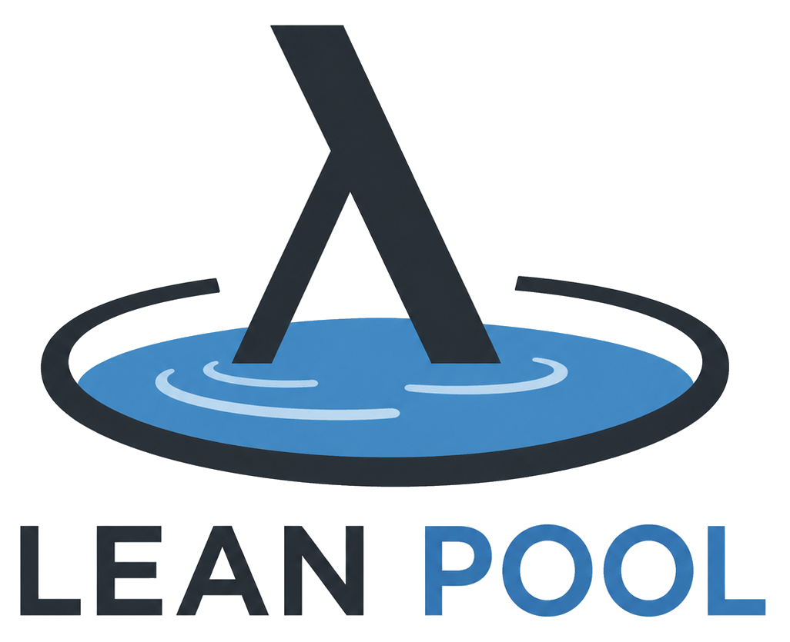

<p align="center">
  
</p>

# lean-pool

[](https://github.com/Vilin97/lean-pool/actions/workflows/lean_action_ci.yml)
[](https://vilin97.github.io/lean-pool/)
[](LICENSE)
[](https://doi.org/10.5281/zenodo.20513444)

Lean Pool sits between [`mathlib`](https://github.com/leanprover-community/mathlib4) and [`merely-true`](https://github.com/merely-true/merely-true), preserving Lean 4 formalizations that don't fit mathlib's scope. Instead of mathlib's high-bar human review, it relies on deterministic linters and LLM judgment, so it can grow faster while staying `sorry`-free and pinned to the latest Mathlib. See [`MOTIVATION.md`](MOTIVATION.md) for the why, and browse the API docs at <https://vilin97.github.io/lean-pool/>.

<!-- BEGIN STATS -->
**118** formalization projects · **863,011** lines of Lean
<!-- END STATS -->

<sub>(stats above are refreshed automatically by [`readme-stats.yml`](.github/workflows/readme-stats.yml) — edit [`python/lean_pool/stats.py`](python/lean_pool/stats.py), not the numbers)</sub>

So far, projects have been added by hand: each is a suitable, permissively licensed (Apache-2.0 or MIT) Lean repository, bumped to the latest Lean and Mathlib, made to pass [CI](.github/workflows/lean_action_ci.yml) — it builds warning-free and clears Mathlib's linters, the style checker, and the repository quality gates (no `sorry`/`admit`, no axioms beyond `Classical.choice`/`propext`/`Quot.sound`, no `unsafe`/`partial`, file headers, size limits) — and an [LLM review](.github/REVIEW_RULES.md) of fit and significance, then merged.

### Getting started

Requires Lean (via [`elan`](https://leanprover-community.github.io/install/), with the toolchain pinned in [`lean-toolchain`](lean-toolchain)) and Python 3.13+ with [`uv`](https://docs.astral.sh/uv/).

```bash
make setup    # pull Mathlib oleans, build the whole pool (~1.5h), install Python tooling
```

To work on a single project you don't need the whole pool built — see the
[fast per-project build](CONTRIBUTING.md#dev-setup) in `CONTRIBUTING.md`.

### Contributing

See [`CONTRIBUTING.md`](CONTRIBUTING.md).

### Credits

Created as part of the [UW Lean Hackathon](https://uw2026leanhackathon.github.io/) by [Vasily Ilin](https://github.com/Vilin97) and [Justin Asher](https://github.com/justincasher).
